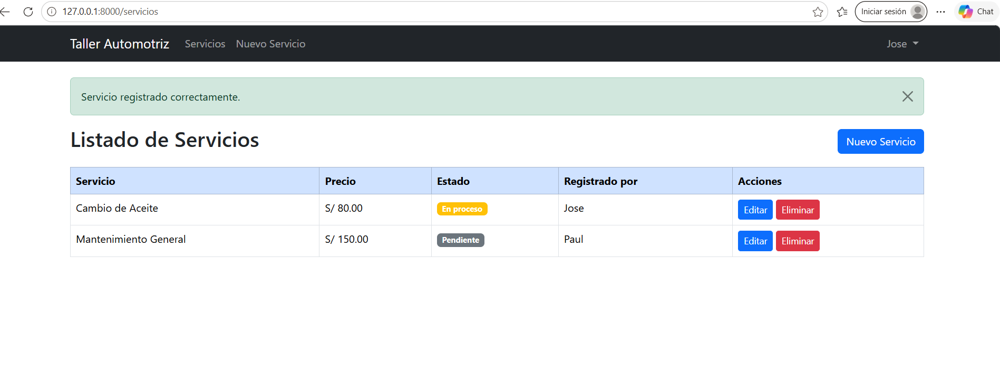
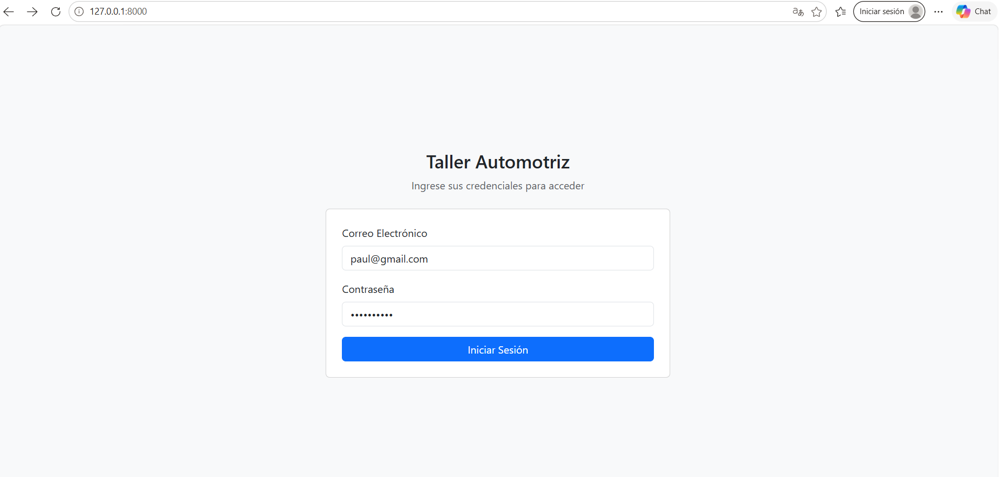
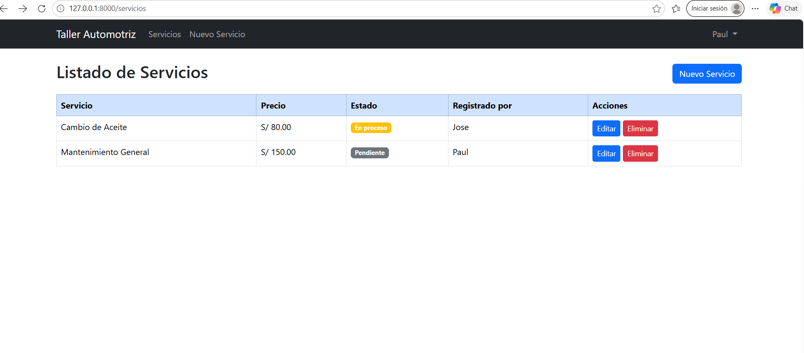

# Sistema Taller Automotriz - Valoración 2

## Descripción

Sistema web desarrollado en Laravel para la gestión de servicios de un taller automotriz.
Implementa autenticación manual de usuarios y un módulo completo de Servicios donde cada
registro se asocia automáticamente al usuario autenticado que lo creó.

Proyecto desarrollado como parte de la Segunda Valoración Parcial del curso.

## Tecnologías utilizadas

- **Laravel 13**
- **PHP 8.4**
- **MySQL**
- **Bootstrap 5** (vía CDN)
- **Blade Templates**

## Funcionalidades implementadas

- **Login manual** — Autenticación con `Auth::attempt()`, regeneración de sesión y validación de credenciales.
- **Middleware guest/auth** — Protección de rutas: solo usuarios invitados pueden acceder al login; solo usuarios autenticados pueden acceder al módulo Servicios.
- **Registro de servicios** — CRUD completo: crear, listar, editar y eliminar servicios del taller.
- **Asociación automática del usuario autenticado** — Cada servicio registra el `user_id` del usuario que lo creó sin solicitarlo en el formulario.
- **Logout** — Cierre de sesión con destrucción de sesión, invalidación y regeneración de token.
- **Validaciones** — Validación de campos con `$request->validate()` tanto en store como en update.
- **Relaciones Eloquent** — `Servicio belongsTo User` y `User hasMany Servicio`.

## Pruebas de funcionamiento

### Prueba 1 — Login



### Prueba 2 — Listado de Servicios



### Prueba 3 — Registro de Servicio



## Ejecución del proyecto

```bash
composer install
cp .env.example .env
php artisan key:generate
```

Configurar la base de datos MySQL en el archivo `.env`:

```
DB_CONNECTION=mysql
DB_HOST=127.0.0.1
DB_PORT=3306
DB_DATABASE=valoracion2
DB_USERNAME=root
DB_PASSWORD=
```

Luego ejecutar:

```bash
php artisan migrate
php artisan serve
```

## Usuarios de prueba

Los usuarios se crean mediante Tinker utilizando `bcrypt()` o `Hash::make()` para almacenar las contraseñas de forma segura:

```bash
php artisan tinker
```

```php
App\Models\User::create([
    'name' => 'Mecánico Juan',
    'email' => 'juan@taller.com',
    'password' => bcrypt('password123'),
]);

App\Models\User::create([
    'name' => 'Mecánico Pedro',
    'email' => 'pedro@taller.com',
    'password' => bcrypt('password123'),
]);
```
